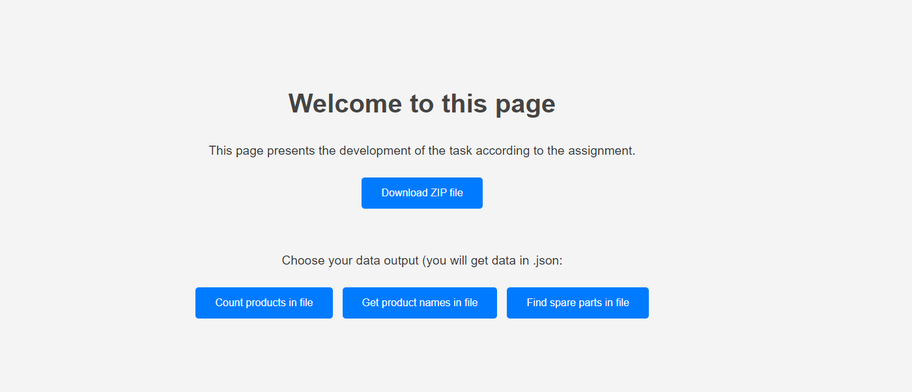

# XML Parser
This is a simple Python script that processes an XML file containing product data from AstraModel. The script provides the following functionality:

- Count the total number of products.
- List product names (one per line).
- List spare parts for products that have them.

The script is built using Flask to provide a web interface where users can access the results via HTTP endpoints.

## Features
- Product Count: Displays the total number of products in the XML file.
- Product Names: Lists all product names, one per line.
- Spare Parts: Lists spare parts for products that have them, along with the associated product name.

## Requirements
see requirements.txt

## How to Use

Run the script using the following command:

`python app.py`

Access the web interface:

Open your browser and go to address you can check in console. 
You will see a simple web interface with links to the following endpoints:

**Download ZIP file with data
Product Count: /count
Product Names: /names
Spare Parts: /spare_parts**

## Code Structure
**app.py:** 
The main script that contains the Flask application and the logic for parsing the XML file.

Project contains dockerfile for buildilng docker image and starting .yml file.
If you want run application in docker containers, you have to build an image at first, then you can run by your addon in your IDE or start upt in console with running start_service.yml.

**Testing:**
The script includes sample of tests to ensure the functionality works as expected. 
To deploy this script live, you can use a service like Heroku, PythonAnywhere, or any other web hosting service that supports Python and Flask.

**How it can looks like?**

Author
Barbora H.

Enjoy using the XML Parser! 
